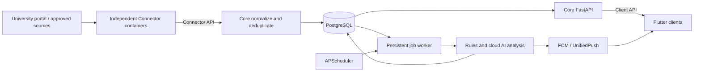

# Campus AI

Campus AI is a personal campus information assistant that collects announcements from university portals and approved public channels, stores them in a durable database, uses a cloud AI service to identify important items, and keeps a cross-platform inbox in sync.

The project is currently in **Phase 0: technical validation**. Source Connectors are independent, runtime-configured services, and the repository does not ship an institution-specific URL, account, or credential. The planned server target is a fixed-IP Debian host, while the client targets Windows, Linux, and Android with one Flutter codebase.

> This is an early validation build, not a production-ready release. Real portal access, cloud AI quality, Android push delivery, and Windows packaging still require environment-specific testing.

## What It Does

- Collects announcements on a daily schedule or through manually queued jobs.
- Supports independently built static HTTP and Playwright Connector services.
- Publishes a versioned HTTP/JSON Connector API and a standalone Python Connector SDK.
- Normalizes source facts through the versioned `CampusItemBatch` contract while Core owns fingerprints, analysis, and notification state.
- Prevents duplicate messages and duplicate background jobs.
- Sends normalized content to a replaceable OpenAI-compatible cloud API.
- Validates AI output against a structured schema before storing it.
- Extracts summaries, relevance, importance, urgency, audiences, action items, and deadlines.
- Provides an application inbox with offline caching and read-state preservation.
- Lets Flutter clients discover Connectors, generate source forms from JSON Schema, complete generic authentication challenges, and follow manual sync jobs through Core.
- Supports FCM and UnifiedPush-compatible notification transports behind a common interface.
- Records architectural decisions, validation results, requirements, and development history in Markdown.

## Key Characteristics

### Durable by default

PostgreSQL stores sources, messages, analyses, jobs, and notification delivery records. The built-in job queue provides deduplication keys, bounded retries, exponential backoff, and recovery of stale locks. Container recreation does not discard queued work or collected data.

### Configuration over hard-coding

Campus AI is designed for multiple institutions and source types. Portal addresses, allowed domains, account references, deployment endpoints, and credentials belong in runtime configuration or a secret store—not in application source, committed documentation, container images, or client binaries. Reserved example domains are used only in tests and templates.

### Connectors over Core customization

School-specific login, navigation, and parsing belong in independent Connectors. Core only knows the versioned Connector protocol and never imports a concrete Connector implementation. Each Connector declares its Manifest and configuration JSON Schema, owns its source session, emits normalized batches, and can be developed, tested, versioned, built, and deployed without the Core package or database.

### Human-assisted authentication

The system does not bypass CAPTCHAs, SMS verification, access controls, or anti-automation measures. When a configured portal requires interactive verification, authentication is performed with the user present and the resulting browser session is stored in encrypted form.

Session lifetime is observed independently for every source and must never be encoded as a universal fixed interval. A source pauses and asks for re-authentication whenever its actual session becomes invalid.

### Cloud AI with a narrow boundary

AI inference runs through a server-side, OpenAI-compatible API adapter. Provider credentials never belong in the Flutter client. MCP is reserved for future tool integration and is not used as the model inference protocol.

### One client codebase

The Flutter application uses Material 3 and responsive navigation for Linux, Windows, and Android. Riverpod manages application state, `go_router` handles navigation, and Drift/SQLite provides the local offline cache. English is the complete compatibility fallback; optional Chinese localization is isolated to presentation strings, while API fields, error codes, and Connector identifiers remain stable English tokens.

## Architecture



Core remains a modular monolith: API, worker, and scheduler processes share one Python image but run with separate lifecycles. Connectors do not share that image or import Core. Browser automation belongs to an optional Connector image, so Chromium is absent from Core and other Connectors.

### Compose services

| Service | Responsibility |
| --- | --- |
| `postgres` | Persistent messages, analyses, jobs, sources, and delivery records |
| `migrate` | One-shot Alembic migration; other backend services wait for it to succeed |
| `api` | FastAPI health, message, job, Connector discovery, source, and authentication endpoints |
| `worker` | Calls registered Connectors and runs AI analysis jobs |
| `scheduler` | Daily collection job creation |
| `connector-static` | Independent generic HTTP/CSS-selector Connector |
| `connector-browser` | Optional independent Playwright Connector with encrypted session state |

The Flutter application is installed directly on each client device and is not packaged inside Docker.

## Technology Path

| Area | Technology | Why |
| --- | --- | --- |
| Client | Flutter, Dart, Material 3 | Shared Windows/Linux/Android UI and a consistent design system |
| State and navigation | Riverpod, `go_router` | Explicit state flow and testable routing |
| Offline storage | Drift, SQLite | Typed local persistence across Flutter targets |
| API | Python, FastAPI, Pydantic | Typed contracts and a low-friction Python ecosystem |
| Connector boundary | OpenAPI, HTTP/JSON, standalone Python SDK | Independent development, language-neutral implementations, and explicit compatibility |
| Database | PostgreSQL | Durable relational storage with JSON and search capabilities |
| Data access | SQLAlchemy, Alembic | Mature ORM and repeatable schema migrations |
| Static collection | HTTPX, selectolax | Lightweight HTTP and HTML processing |
| Browser collection | Playwright, Chromium | Isolated support for JavaScript and user-assisted sessions |
| Scheduling and jobs | APScheduler, PostgreSQL queue | Simple single-server deployment without an early Redis dependency |
| AI | OpenAI-compatible cloud API, strict JSON Schema | Replaceable providers and validated structured results |
| Notifications | FCM, UnifiedPush/ntfy | GMS delivery plus a self-hostable alternative |
| Deployment | Docker Compose on Debian | Reproducible single-host operation, backup, and migration |
| CI | GitHub Actions | Backend, Compose, Linux, Windows, and Android validation jobs |

## Current Validation Status

| Area | Status |
| --- | --- |
| Python tests | 37 passing across SDK, Connectors, and Core; 73% aggregate coverage |
| PostgreSQL migrations | Clean and populated revision `0002` databases upgraded through CampusItem revision `0003` |
| Compose startup | Passed from a clean PostgreSQL 18 volume |
| Persistent job queue | Enqueue, consume, deduplicate, and container-recreation persistence passed |
| Playwright Connector | Independent image built successfully; Chromium launched and rendered a page |
| Flutter analysis and tests | Clean analysis, 9 tests passing, including dynamic source forms, auth challenges, and optional Chinese presentation strings |
| Linux client | Debug bundle built successfully |
| Android client | Project generated; blocked locally on Android SDK and Firebase/device setup |
| Windows client | Project generated; build validation awaits a Windows runner |
| Connector architecture | Protocol, SDK, Core client, runtime registry, static/browser examples, auth challenge models, and conformance tests implemented |
| Source onboarding | Flutter Connector discovery, Schema-driven configuration, source status, generic auth challenges, manual sync, and job polling implemented; isolated Compose flow passed |
| Authenticated portal | Connector-owned encrypted-session tests passed; a real user-assisted source flow is pending |
| Cloud AI | Mock contract passed; real provider and labeled sample evaluation pending |
| Push delivery | Adapters and probes implemented; real FCM/UnifiedPush delivery pending |

See the full [Phase 0 validation report](docs/validation/phase-0-report.md) for evidence and remaining inputs.

## Quick Start

### Prerequisites

- Docker Engine with Docker Compose
- Git
- Flutter only if you want to run or build the client locally

### Start the backend

Create a local configuration file and fill every required database and Connector security value before startup. Compose intentionally refuses to resolve when required database settings, connection URLs, or the shared Connector token are missing:

```bash
cp .env.example .env
docker compose up --build -d
curl http://127.0.0.1:8000/health/ready
```

The API is intentionally bound to `127.0.0.1:8000` by default. A real Debian deployment still needs TLS, authentication, firewall rules, backups, and secret management before it is exposed through a reverse proxy.

Useful lifecycle commands:

```bash
docker compose ps --all
docker compose logs -f api worker scheduler
docker compose down
```

Start the optional browser Connector only when a configured source requires it:

```bash
docker compose --profile browser up --build -d connector-browser
```

### Run backend tests

```bash
python3 -m venv .venv
.venv/bin/pip install -e packages/connector-sdk-python
.venv/bin/pip install -e 'backend[dev]' -e 'connectors/generic-static[dev]' -e 'connectors/generic-browser[dev]'
make test-coverage
```

### Run the Flutter client

With Flutter available on your `PATH`:

```bash
cd frontend
flutter pub get
flutter analyze
flutter test
flutter run -d linux \
  --dart-define=CAMPUS_AI_API_URL=http://127.0.0.1:8000
```

An Android emulator reaches the host API at `http://10.0.2.2:8000`. Firebase configuration is optional for non-push development and must never be committed with real credentials.

## Configuration and Secrets

`.env.example` documents the supported backend settings:

- Database connection, timezone, schedule, polling, and lock timeout
- OpenAI-compatible API base URL, API key, model, and output mode
- FCM project and Google credentials paths
- UnifiedPush/ntfy endpoint
- Connector endpoint registry and internal shared token
- Browser Connector session encryption key
- Source URLs, domain allowlists, parsing rules, and account references supplied at runtime

Use `.env`, `.secrets/`, and `frontend/firebase-config.json` only as ignored local files. Never commit portal cookies, SMS codes, AI keys, Firebase service accounts, device tokens, or production database passwords.

Institution-specific operational notes and source exports should remain outside the repository or under the ignored `docs/private/` directory.

## Project Layout

```text
backend/                 Core FastAPI service, workers, migrations, protocol clients, and tests
frontend/                Independent Flutter Material 3 client for desktop and Android
packages/                Independently publishable Connector SDK packages
connectors/              Independently buildable official example Connectors
contracts/               Versioned Client API and Connector API boundaries
spikes/                  Source, AI, and notification validation utilities
docs/requirements.md     Product and engineering requirements
docs/adr/                Architecture decision records
docs/sources/            Source-specific constraints and validation notes
docs/validation/         Phase reports and device-test procedures
compose.yaml             Single-host service orchestration
.github/workflows/       Automated validation for backend and client targets
```

## Security and Access Boundaries

- Do not automate CAPTCHA or SMS-code acquisition.
- Do not collect content outside explicitly configured and permitted source scopes.
- Pause a source when authentication expires instead of creating a retry storm.
- Encrypt browser session state and keep the encryption key outside the session volume.
- Keep AI and push credentials on the server.
- Send only the minimum necessary content to third-party AI services.
- Review the target site's terms and applicable rules before enabling collection.

## Roadmap

| Phase | Main deliverables | Exit criteria |
| --- | --- | --- |
| **0 — Feasibility validation** (current) | Establish the independent Connector contract/SDK, then validate one authenticated portal, one sustainable public-channel source, cloud AI quality, Android push delivery, and all client build targets | Connector conformance passes; no blocking source or notification issue; generic results and decisions are recorded |
| **1 — Collection loop** | Source configuration, scheduled and manual collection, normalization, deduplication, job diagnostics, and the first production Connectors | Seven consecutive days of traceable collection on the target Debian server |
| **2 — AI and notifications** | Deterministic rules, structured cloud AI analysis, importance policy, deadlines, immediate alerts, and daily digests | Labeled evaluation set passes and trial use shows no material duplicate alerts or fabricated deadlines |
| **3 — Cross-platform MVP** | Complete inbox, search, filters, source management, settings, offline changes, synchronization, and Windows/Linux/Android packages | Core acceptance scenarios pass on all three platforms |
| **4 — Reliability and experience** | Backup/restore drills, monitoring, production authentication, TLS, accessibility, performance work, and parser regression fixtures | Production checklist passes and recovery is demonstrated from a clean environment |

Immediate next steps are to validate a runtime-configured portal flow with the user present, install the Android SDK, run device push tests, evaluate a cloud model on anonymized examples, validate a sustainable approved public-channel source, and move the validated stack to the fixed-IP Debian host.

## Documentation

- [Requirements specification](docs/requirements.md)
- [Development log](docs/development-log.md)
- [Architecture decisions](docs/adr/)
- [Connector development guide](docs/connectors/development.md)
- [Connector API contract](contracts/connector-api/README.md)
- [Authenticated portal integration profile](docs/sources/authenticated-portal.md)
- [Phase 0 validation report](docs/validation/phase-0-report.md)
- [FCM device validation guide](docs/validation/fcm-device-test.md)
