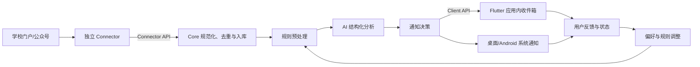

# Campus AI 需求规格说明书

> 文档状态：基础范围已确认
> 版本：0.3.0
> 创建日期：2026-08-19
> 适用阶段：需求确认与 MVP 规划

## 1. 文档目的

本文档定义 Campus AI 的产品目标、范围、核心流程、功能需求、非功能需求、验收标准与建议技术基线，作为后续设计、开发、测试和验收的共同依据。

文中的技术选型是仓库尚无个人技术背景资料时给出的易学、易维护建议，不是不可变的最终决定。关键选型应在开发前通过技术验证并记录为 Markdown ADR（Architecture Decision Record）。

## 2. 产品概述

Campus AI 是一套面向个人使用、可逐步扩展的校园信息助手。系统每天从用户配置的学校门户网站和微信公众号等来源采集新消息，进行去重、归档和 AI 分析，从中识别与用户有关的重要事项，并通过跨设备客户端及时通知用户。

客户端使用 Flutter 与 Material 3 组件开发，目标支持 Windows、Linux 和 Android。采集与分析任务由可持续运行的服务端执行，客户端之间通过同一服务端同步状态。

### 2.1 要解决的问题

- 校园消息分散在多个入口，用户需要反复检查。
- 通知、新闻和办事指南数量多，重要事项容易被遗漏。
- 原文常较长，截止时间、办理对象和所需行动不够醒目。
- 多台设备上的阅读、收藏和处理状态无法统一。

### 2.2 产品目标

- 每天自动、可靠地收集已配置来源的新消息。
- 保留原文和来源依据，避免 AI 结论无法核查。
- 根据个人偏好判断相关性、重要性和紧急程度。
- 将重要信息整理为摘要、待办事项和截止时间并通知用户。
- 在 Windows、Linux、Android 之间同步消息与处理状态。
- 让新增来源、替换 AI 模型和新增通知渠道保持低成本。
- 让其他学校的开发者能够在不了解 Campus AI Core 内部实现的情况下，独立开发、测试、发布和部署 Connector。
- 用 Markdown 持续记录需求、决策、计划、变更与重要开发过程。

### 2.3 成功指标

MVP 试用两周后，以以下指标判断是否达到基本价值：

| 指标 | MVP 目标 |
| --- | --- |
| 已配置来源的日采集任务成功率 | 不低于 95% |
| 同一来源重复消息率 | 低于 2% |
| 新消息入库后完成分析的时间 | 95% 在 10 分钟内 |
| 重要消息通知遗漏率 | 经用户标注后低于 10% |
| 通知中的原文可追溯率 | 100% |
| 跨端状态同步 | 正常联网后 30 秒内可见 |

以上数值是初始目标，数据量与来源稳定性明确后再调整。

### 2.4 通用产品与配置边界

- Campus AI 面向不同学校、门户和公开信息渠道，核心代码、README、通用文档和客户端不得绑定具体学校。
- 站点地址、允许访问的域名和路径、账号引用、解析规则与部署端点必须通过运行时配置提供，不得硬编码进源代码或镜像。
- 密码、短信验证码、Cookie、Token、AI Key 和推送密钥不得提交到仓库；账号标识也应使用外部 Secret 引用，避免进入普通日志和客户端。
- 需要交互验证的门户采用用户辅助认证并复用加密会话，不自动读取短信、破解验证码或绕过访问控制。
- 后端可部署在固定 IP 的 Debian 服务器上，但部署环境和会话寿命都是实例级配置，不能成为所有来源的通用假设。

通用认证门户的安全边界和验证清单见 [`sources/authenticated-portal.md`](sources/authenticated-portal.md)。具体学校的运行参数保存在仓库外或被忽略的 `docs/private/` 中。

### 2.5 Client、Core 与 Connector 边界

项目当前采用单一 Git 仓库，但 Client、Core、Connector SDK 和各 Connector 必须按照未来可拆分为独立仓库的边界组织、构建和测试：

| 组件 | 负责 | 不负责 |
| --- | --- | --- |
| Client | 用户交互、本地缓存、离线操作、展示认证挑战、跨端体验 | 直接访问校园网站、保存门户会话、持有 AI 或 Connector 服务密钥、执行定时采集 |
| Core | 用户与设备认证、来源实例、任务调度、持久化、去重、AI、通知、同步和审计 | 实现任何具体学校的登录、页面选择器或抓取规则 |
| Connector | 理解自身配置、完成来源认证、维护来源会话、增量采集、解析并输出统一消息 | 直接访问 Core 数据库、调用 AI、决定重要性、发送设备通知或管理 Campus AI 用户 |
| Connector SDK | 协议模型、服务包装器、错误模型、开发模板和兼容性测试 | 包含具体学校规则或依赖 Core 内部模块 |

Client 只通过版本化 Client API 访问 Core；Core 只通过版本化 Connector API 调用 Connector。Connector 不得通过 Python 内部导入、共享数据库表或共享文件路径绕过协议边界。开发阶段可以同仓库运行，但每个组件必须具备独立依赖、测试、构建入口和容器镜像。

## 3. 用户与使用场景

### 3.1 目标用户

首个版本只服务系统所有者本人，按单用户系统设计。数据模型和接口避免彻底锁死多用户扩展，但 MVP 不实现注册、组织管理和公开运营能力。

### 3.2 典型使用场景

1. 用户配置学校门户入口、登录方式和要关注的公众号。
2. 服务端每天在设定时间自动采集，也允许用户手动触发。
3. 系统识别新增或更新内容，保存原文、附件元数据和来源信息。
4. 规则引擎与 AI 提取摘要、适用对象、重要程度、截止时间和行动项。
5. 重要或临近截止的消息立即通知，其余消息进入每日摘要。
6. 用户在任一设备上查看原文依据，标记已读、收藏、忽略或已完成。
7. 状态同步到其他设备；用户反馈用于调整后续判断。
8. 来源登录失效或连续采集失败时，系统通知用户处理，而不是静默停止。

## 4. 产品范围

### 4.1 MVP 范围

- 至少接入一个学校门户来源。
- 接入一组经可行性验证且合规的微信公众号信息来源。
- 每日定时采集、手动采集、增量更新、去重和失败重试。
- 结构化保存正文、发布时间、原文链接、来源和附件元数据。
- AI 摘要、分类、相关性、重要性、紧急性、行动项与截止时间提取。
- 重要消息通知、每日摘要和来源异常通知。
- 消息列表、详情、搜索、筛选、收藏、状态管理和反馈。
- Windows、Linux、Android 客户端使用相同业务能力并同步数据。
- 基础设置、诊断日志、数据导出与备份恢复。
- Docker Compose 单机部署说明。

### 4.2 暂不纳入 MVP

- iOS 和 macOS 客户端。
- 面向公众开放注册或多人协作。
- 自动代替用户报名、提交表单、选课、缴费或发送消息。
- 绕过验证码、访问控制、付费墙或平台反自动化措施。
- 对所有历史消息进行无限量回溯。
- 通用网页爬虫编辑器和插件市场。
- 完整 OCR、语音/视频识别；MVP 仅为后续处理保留附件。
- 以 AI 结论替代原通知或校方解释。

## 5. 总体业务流程



采集、分析、通知三个阶段必须解耦。任一阶段临时失败时，已取得的数据不得丢失，并可独立重试。

## 6. 功能需求

需求优先级采用 MoSCoW：Must 为 MVP 必须完成，Should 为强烈建议，Could 为后续增强，Won't 为当前明确不做。

### 6.1 初始化与部署

| 编号 | 优先级 | 需求 |
| --- | --- | --- |
| FR-001 | Must | 系统应提供 Docker Compose 单机部署方式和 Debian 参考部署，同时支持配置到其他个人服务器、NAS 或云主机。 |
| FR-002 | Must | 首次启动应引导用户创建管理员身份、配置服务地址和设置时区。 |
| FR-003 | Must | 服务端应独立于客户端持续执行定时任务；关闭任何客户端不得停止采集。 |
| FR-004 | Must | 客户端应支持安全连接同一服务端并同步数据。 |
| FR-005 | Should | 提供配置检查页，显示数据库、AI 服务、采集器和通知渠道是否可用。 |
| FR-006 | Must | Client、Core 和 Connector 应分别构建和运行；关闭 Client 不影响 Core，停止单个 Connector 不影响 Core 与其他 Connector。 |
| FR-007 | Must | 当前仓库可以保持 Monorepo，但组件间不得引用对方内部模块；跨组件共享仅通过版本化协议或独立发布的软件包。 |
| FR-008 | Must | Core、Connector SDK、各 Connector 和 Flutter Client 应具有独立依赖声明、测试入口、构建产物和版本。 |
| FR-009 | Must | 客户端以英文作为完整兼容语言和未知区域设置的回退语言；中文可作为可选展示语言。协议字段、错误码、配置键和 Connector 标识不得随界面语言变化。 |

### 6.2 信息来源管理

| 编号 | 优先级 | 需求 |
| --- | --- | --- |
| FR-101 | Must | 用户可新增、编辑、启用、暂停和删除信息来源。 |
| FR-102 | Must | 每个来源应记录名称、类型、入口地址、采集频率、最近成功时间、最近错误和启用状态。 |
| FR-103 | Must | 来源适配器应使用统一接口，以便门户、RSS、公开网页、公众号等实现分别维护。 |
| FR-104 | Must | 对需要登录的来源，系统应支持安全保存会话或凭据，并在失效时要求重新认证。 |
| FR-105 | Must | 系统不得尝试自动绕过验证码；出现验证码时应暂停该来源并提醒用户介入。 |
| FR-106 | Should | 新增来源时可先执行连接测试和样例预览，用户确认后再启用定时采集。 |
| FR-107 | Should | 用户可为来源设置关注范围、关键词和较低/较高默认权重。 |
| FR-108 | Must | 微信公众号接入方式必须先完成合规性与稳定性验证，优先采用官方接口、授权能力、RSS/邮件等允许的渠道；不可用时应明确显示限制。 |
| FR-109 | Must | 每个门户的入口 URL、允许域名和路径范围必须由运行时配置提供；URL 必须为绝对 HTTP(S) 地址且不得内嵌账号或密码。 |
| FR-110 | Must | 门户会话应加密持久化并记录验证时间、最近成功时间和观测到的失效时间；会话寿命按来源实测，不设置全局固定重新验证周期。 |
| FR-111 | Must | 网站、账号、密码、Cookie、验证码与 Token 不得硬编码；敏感值必须来自外部 Secret，普通来源配置只保存非敏感参数或 Secret 引用。 |
| FR-112 | Must | 每个来源必须关联一个稳定的 `connector_id`；Core 不得根据学校名称、网站地址或页面结构选择代码路径。 |
| FR-113 | Must | Connector 必须能够作为独立进程或容器通过 HTTP/JSON Connector API 运行，不得直接访问 Core 数据库或导入 Core 内部模块。 |
| FR-114 | Must | Connector 应提供 Manifest，至少声明 Connector ID、版本、协议版本、显示名称、能力、配置 Schema 和是否需要浏览器。 |
| FR-115 | Must | Connector 的普通输入由其配置 Schema 定义；Client 可据此生成配置表单，Core 只执行通用校验、权限控制和持久化。 |
| FR-116 | Must | Connector 配置 Schema 必须能标识 Secret 字段；Core 只保存加密值或 Secret 引用，一次性验证码使用后不得持久化。 |
| FR-117 | Must | Connector 认证流程使用统一状态和挑战模型，至少能表达无需认证、需要认证、等待用户输入、就绪和失效，以及密码、短信、扫码、验证码和浏览器交互等挑战。 |
| FR-118 | Must | Connector 同步结果必须使用版本化 `CampusItemBatch` / `CampusItem` 契约；稳定字段、游标提交语义、附件访问方式、扩展命名空间和禁止传输的敏感数据遵循 `docs/connectors/campus-item-contract.md`。 |
| FR-119 | Must | Connector 使用统一错误码表达配置无效、需要认证、访问拒绝、限流、来源变化和临时故障；Core 据此决定暂停、退避、重试或通知用户。 |
| FR-120 | Must | Connector SDK 应提供服务包装器和兼容性测试，使开发者只需实现 Manifest、配置校验、认证和同步逻辑。 |
| FR-121 | Must | Core 必须校验 Connector ID、版本和协议兼容性，拒绝将注册 ID 与 Manifest 不匹配的服务用于同步。 |
| FR-122 | Must | Connector 的网络地址和内部认证凭据必须由部署时注册或运行时配置提供，不得编译进 Core 或 Client。 |
| FR-123 | Should | 官方 Connector 可与 Core 保持在同一仓库开发，但必须可以独立构建镜像、运行测试和发布；第三方 Connector 可位于完全独立的仓库。 |
| FR-124 | Must | Client 应通过 Core 发现 Connector，并按 Manifest 配置 Schema 生成普通配置表单；不支持的 Schema 类型必须明确提示，不能静默丢弃字段。 |
| FR-125 | Must | Client 展示认证挑战和手动同步任务状态时只调用 Core；Secret 配置字段、密码和一次性验证码不得进入普通来源配置或客户端持久缓存。 |
| FR-126 | Must | 普通“删除来源”必须实现为可恢复归档：停用来源、停止调度并清除 Core 凭据引用，但保留已采集消息、分析和任务记录；永久删除数据另设高风险流程。 |
| FR-127 | Must | 首版来源级计划只支持 `manual` 与 `daily`；每日计划必须保存 IANA 时区、当地时间和下一次 UTC 执行时间，服务重启后最多补执行一次错过的计划。 |
| FR-128 | Must | 来源创建后不得原地更改 Connector ID 或固定协议版本；更换 Connector 时新建来源，避免错误复用认证状态和游标。 |
| FR-129 | Should | 来源预览使用异步限量任务，最多返回 10 条裁剪后的标准消息；不得写入消息、创建分析任务或推进来源游标。 |
| FR-130 | Must | 来源检查应验证 Connector 可用性、协议版本、已保存配置和认证状态，但不得采集或持久化消息。 |

### 6.3 采集与内容处理

| 编号 | 优先级 | 需求 |
| --- | --- | --- |
| FR-201 | Must | 系统应按用户时区每天至少执行一次采集，并支持来源级时间设置。 |
| FR-202 | Must | 用户可手动触发全部来源或单个来源采集，并查看实时状态。 |
| FR-203 | Must | 采集任务应支持超时、有限重试、指数退避和失败告警，避免无限循环。 |
| FR-204 | Must | 系统应增量采集，只处理首次出现或内容发生变化的消息。 |
| FR-205 | Must | 系统应结合来源内唯一标识、规范化链接和内容指纹去重。 |
| FR-206 | Must | 每条消息至少保存标题、来源、原文链接、发布时间、采集时间、纯文本正文和内容指纹。 |
| FR-207 | Must | 页面更新后应保留版本或变更记录，避免覆盖后无法追溯。 |
| FR-208 | Should | 保存附件名称、链接、类型和哈希；是否下载原文件由配置和存储策略决定。 |
| FR-209 | Must | 解析失败时应保留原始响应的受控快照或足够的诊断信息，且不得在普通日志中暴露凭据。 |
| FR-210 | Should | 用户可配置合理的历史回溯窗口与每次采集上限。 |
| FR-211 | Must | 采集器应遵守适用法律、网站条款、访问权限和合理请求频率。 |

#### 6.3.1 Core 标准输入边界

Connector 只输出从来源中取得并规范化的事实，不输出数据库 ID、抓取时间、内容指纹、AI 结论或通知状态。Core 接收的标准单位是 `CampusItem`，传输单位是 `CampusItemBatch`：

- `CampusItem` 必须具有来源实例内稳定的 `external_id`、信息类型、原文 URL、原始标题和纯文本正文；可携带明确的发布者、发布时间、更新时间、富文本和附件引用。
- 学校或 Connector 特有数据只能进入以 Connector ID 为键的 `extensions` 命名空间，Core 业务逻辑不得依赖其中字段。
- 密码、验证码、Cookie、浏览器状态、访问令牌和带凭据 URL 不得出现在 Item、附件、扩展、警告或游标中。
- Core 使用 `(source_id, external_id)` 保证幂等；同一 ID 内容改变时视为更新，仅在标准内容指纹改变后重新分析。
- `next_cursor` 对 Core 完全不透明，只能在本批数据成功持久化后保存并于下一次同步原样传回。
- 登录受限附件使用 Connector 自有的不透明引用，不得把来源会话交给 Core。

完整 JSON 结构、字段约束、附件模式和更新规则见 [CampusItem Contract v1](connectors/campus-item-contract.md)。该文档与 Connector OpenAPI 共同构成协议规范。

### 6.4 AI 与规则分析

| 编号 | 优先级 | 需求 |
| --- | --- | --- |
| FR-301 | Must | AI 分析前先执行确定性规则，识别明确关键词、日期、来源权重和黑白名单。 |
| FR-302 | Must | AI 输出必须是经过结构校验的数据，而非仅保存自由文本。 |
| FR-303 | Must | 每条消息应生成一句话摘要、详细摘要、分类、相关性分数、重要性分数、紧急性、适用对象、行动项和截止时间。 |
| FR-304 | Must | 重要判断应附简短理由及对应原文证据；客户端可一键打开原文。 |
| FR-305 | Must | 无法确定的字段应标记为未知或低置信度，不得编造日期、要求或链接。 |
| FR-306 | Must | 用户可配置个人画像，包括院系、年级、培养层次、校区、身份、兴趣关键词和忽略主题。 |
| FR-307 | Must | 用户可选择“重要”“不重要”“与我无关”或修正截止时间，作为后续调优依据。 |
| FR-308 | Must | 相同内容与相同分析版本不得重复调用模型；系统应记录模型、提示词版本、耗时和用量。 |
| FR-309 | Must | AI 推理使用可替换的云端提供者；MVP 由服务端直连 OpenAI 兼容 API。MCP 不作为推理 API，仅为未来受限工具接入预留。 |
| FR-310 | Must | AI 服务不可用时，消息仍应入库并通过规则产生基础结果，稍后补充分析。 |

建议的结构化分析结果如下，具体字段在 API 设计阶段定稿：

```json
{
  "category": "academic",
  "summary_short": "本周五前完成课程补选确认。",
  "summary_detail": "……",
  "relevance_score": 92,
  "importance_score": 88,
  "urgency": "high",
  "audience": ["本科生", "相关课程学生"],
  "action_items": ["登录教务系统确认补选结果"],
  "deadlines": [
    {
      "time": "2026-08-21T17:00:00+08:00",
      "timezone": "Asia/Shanghai",
      "confidence": 0.96,
      "evidence": "请于8月21日17:00前……"
    }
  ],
  "reason": "与用户身份匹配且存在临近截止时间",
  "confidence": 0.91
}
```

### 6.5 通知与摘要

| 编号 | 优先级 | 需求 |
| --- | --- | --- |
| FR-401 | Must | 所有消息均进入应用内收件箱；重要消息可触发系统通知。 |
| FR-402 | Must | 用户可分别配置即时通知阈值、每日摘要时间和免打扰时段。 |
| FR-403 | Must | 同一消息的同一事件不得向同一设备重复通知。 |
| FR-404 | Must | 通知应展示来源、标题、简短摘要、截止时间（若有）并可直达详情。 |
| FR-405 | Must | 每日摘要应汇总未读的重要消息、当日新增消息和临近截止事项。 |
| FR-406 | Must | 采集连续失败、登录失效、AI 长时间不可用和备份失败应产生系统告警。 |
| FR-407 | Should | 用户可选择其他通知渠道，如电子邮件、Webhook 或兼容的推送服务。 |
| FR-408 | Should | 用户可为行动项创建本地提醒；写入系统日历作为后续增强。 |
| FR-409 | Must | Android 推送方案应经过真机验证；如果后台推送受系统或网络环境限制，界面必须说明当前送达能力。 |

### 6.6 消息浏览与处理

| 编号 | 优先级 | 需求 |
| --- | --- | --- |
| FR-501 | Must | 首页应展示重要未读、即将截止、今日新增、来源异常四类概览。 |
| FR-502 | Must | 消息列表支持按来源、类别、重要性、时间、已读状态和收藏状态筛选。 |
| FR-503 | Must | 支持标题、正文和 AI 摘要的关键词搜索。 |
| FR-504 | Must | 详情页应明确区分“原文信息”与“AI 分析”，展示采集时间、原文链接和证据。 |
| FR-505 | Must | 用户可标记已读/未读、收藏、忽略、已完成，并在各设备同步。 |
| FR-506 | Must | 若原消息更新，客户端应展示“已更新”标识及关键变更。 |
| FR-507 | Should | 用户可查看消息时间线和同一事项的关联消息。 |
| FR-508 | Should | 在宽屏使用导航栏与多栏布局，在手机使用底部导航，业务能力保持一致。 |

### 6.7 跨端同步与离线能力

| 编号 | 优先级 | 需求 |
| --- | --- | --- |
| FR-601 | Must | Windows、Linux、Android 客户端共享服务端数据源。 |
| FR-602 | Must | 已读、收藏、完成、忽略和反馈状态应跨设备同步。 |
| FR-603 | Must | 客户端应缓存最近数据，短时离线时仍可浏览已加载内容。 |
| FR-604 | Must | 离线产生的状态变更应在恢复联网后上传；冲突按服务端版本和字段级规则处理。 |
| FR-605 | Should | 服务端主动推送更新；连接不可用时退化为周期同步。 |
| FR-606 | Must | 客户端应显示最后同步时间、离线状态和失败原因。 |
| FR-607 | Must | Client 不得直接连接 Connector；所有配置、认证挑战和同步操作必须经由 Core 的权限检查与审计。 |
| FR-608 | Must | Client API 与 Connector API 必须分别定义和版本化，任一协议的变化不得要求另一侧读取实现源码。 |

### 6.8 设置、审计与数据管理

| 编号 | 优先级 | 需求 |
| --- | --- | --- |
| FR-701 | Must | 用户可管理个人画像、来源、采集计划、AI、通知、存储和隐私设置。 |
| FR-702 | Must | 提供任务记录，显示每次采集、分析、通知的状态、数量、耗时和可理解的错误。 |
| FR-703 | Must | 所有敏感日志字段应脱敏；客户端默认不展示底层堆栈。 |
| FR-704 | Must | 用户可导出消息、分析、标签和配置；敏感凭据默认不导出。 |
| FR-705 | Must | 系统应支持数据库与必要文件的备份、校验和恢复演练。 |
| FR-706 | Must | 用户删除数据时，应明确删除范围；高风险删除需二次确认。 |
| FR-707 | Should | 用户可配置正文、快照、附件和日志的保留期限。 |

### 6.9 项目文档要求

| 编号 | 优先级 | 需求 |
| --- | --- | --- |
| DOC-001 | Must | 项目过程文档统一使用 Markdown，并纳入版本控制。 |
| DOC-002 | Must | 需求变化应更新本文档与变更记录，不只保留在聊天记录中。 |
| DOC-003 | Must | 重要技术选择应记录为 ADR，包含背景、候选方案、决定和后果。 |
| DOC-004 | Must | 每个开发阶段应维护计划、实施记录、测试结果和遗留问题。 |
| DOC-005 | Must | 部署、配置、备份恢复、来源适配器开发和故障排查应有可执行说明。 |
| DOC-006 | Should | 图示优先使用 Mermaid、PlantUML 或文本格式，避免只有不可审阅的二进制源文件。 |

建议的文档目录：

```text
docs/
├── requirements.md          # 本文档
├── roadmap.md               # 里程碑与版本计划
├── changelog.md             # 用户可见变更
├── development-log.md       # 重要实施与验证记录
├── architecture/            # 架构说明
├── adr/                     # 技术决策记录
├── api/                     # API 契约
├── connectors/              # Connector 协议、开发与来源适配说明
├── testing/                 # 测试计划与报告
└── operations/              # 部署、备份和排障
```

## 7. 业务规则

### 7.1 消息状态

- `unread`：尚未查看。
- `read`：已经查看，但不代表事项已处理。
- `completed`：相关行动项已完成。
- `ignored`：用户明确不希望继续关注。
- `archived`：不在常用列表展示，但仍可检索。

收藏与上述状态相互独立。客户端应避免用“已读”等同于“已完成”。

### 7.2 重要性与通知决策

最终通知决策至少综合以下信息：

- 与用户画像的匹配程度。
- 是否存在明确行动要求或截止时间。
- 截止时间距离当前时间的长短。
- 来源可信度与用户设置的来源权重。
- 奖学金、考试、选课、毕业、缴费、资助、安全等高关注主题规则。
- 用户关键词、忽略主题和历史反馈。
- AI 置信度；低置信度结果不应直接触发过强提醒。

分数阈值必须可配置。紧急且重要的信息发送即时通知；重要但不紧急的信息进入每日摘要；不重要信息只进入收件箱。任何自动决策均不删除消息。

### 7.3 截止时间

- 所有时间在服务端保存为带时区的时间值，默认显示 `Asia/Shanghai`。
- 只有日期而没有具体时刻时，应保留“全天/时间未知”语义，不擅自补成 23:59。
- 相对日期必须结合原文发布时间和来源时区解析，并保留原始文本。
- 消息更新导致截止时间改变时，应重新评估并提醒用户。

### 7.4 去重与更新

- 同一来源优先使用稳定的消息 ID。
- 无稳定 ID 时，使用规范化 URL 与内容指纹。
- 跨来源转载可标记为关联或疑似重复，但 MVP 不自动删除其中任何一条。
- 正文变化时产生新版本，并只对变化可能影响分析的内容重新分析。

## 8. 数据需求

### 8.1 核心实体

| 实体 | 用途 | 关键字段示例 |
| --- | --- | --- |
| UserProfile | 个性化判断 | 身份、院系、年级、校区、关键词、时区 |
| Device | 跨端与通知 | 平台、设备标识、最后活跃、推送能力 |
| Source | 信息来源 | 类型、入口、计划、状态、最后成功时间 |
| CredentialRef | 凭据引用 | 来源、加密数据或密钥引用、失效时间 |
| FetchRun | 采集运行 | 开始/结束、状态、数量、错误摘要 |
| Message | 规范化消息 | 标题、来源、原文链接、发布时间、正文、指纹 |
| MessageRevision | 消息版本 | 版本号、正文、变化摘要、采集时间 |
| Attachment | 附件元数据 | 名称、类型、链接、哈希、本地路径 |
| Analysis | AI 分析 | 结构化结果、模型、提示词版本、置信度、用量 |
| UserMessageState | 用户状态 | 已读、收藏、忽略、完成、更新时间 |
| Feedback | 用户反馈 | 反馈类型、修正值、备注 |
| Notification | 通知记录 | 渠道、设备、状态、去重键、发送时间 |
| JobRun | 后台任务 | 类型、重试次数、状态、错误、耗时 |

### 8.2 数据保留

- 结构化消息和用户状态默认长期保留，直到用户删除。
- 原始网页快照、附件和详细日志应有独立的保留期限与容量上限。
- 普通删除来源只执行可恢复归档并保留历史消息；永久删除来源数据必须作为单独的高风险操作明确选择。
- 备份中包含的已删除敏感数据应随备份轮换最终清除。

## 9. 非功能需求

### 9.1 安全与隐私

- 所有远程连接使用 TLS；不得允许客户端以明文 HTTP 传输凭据或内容。
- 密码、Cookie、令牌和 AI API Key 不得明文写入数据库、日志或 Markdown 文档。
- 服务端敏感配置使用环境变量、受限配置文件或密钥存储，并提供轮换方式。
- 客户端令牌存入各平台安全存储，不写入普通偏好文件。
- API 采用短期访问令牌与可撤销会话；即使 MVP 单用户也要有认证。
- 服务端执行最小权限原则，采集器之间尽量隔离故障与凭据。
- 发送给云端 AI 的内容范围应可见、可配置；对学号、姓名等个人信息提供脱敏策略。
- 诊断包导出前自动脱敏并让用户确认包含内容。

### 9.2 可靠性

- 后台任务使用持久化队列或等效机制，服务重启后不得静默丢失待处理任务。
- 采集、分析和通知操作应具有幂等性。
- 单个来源故障不得阻塞其他来源。
- 每日任务连续两次失败或超过设定时限未成功，应显著告警。
- 数据库迁移必须可追踪；升级前提示备份。

### 9.3 性能与容量

初始容量假设为：50 个来源、累计 10 万条消息、每天不超过 1,000 条新增消息、3 台活跃设备。

- 普通消息列表在上述数据量下，服务端接口 95% 响应时间低于 500 ms（不含公网延迟）。
- 关键词搜索 95% 响应时间低于 2 秒。
- Flutter 常用页面应保持流畅，长列表使用分页或增量加载。
- AI 调用和网页采集不得阻塞面向客户端的 API 工作进程。

### 9.4 可用性与界面

- 遵循 Material 3，优先使用 Flutter 官方 Material 控件和一致的设计令牌。
- 支持浅色、深色和跟随系统主题。
- 窗口尺寸变化时自适应，不简单放大手机布局。
- 键盘、鼠标、触屏均可完成核心任务；桌面端提供合理的快捷键和悬停反馈。
- 关键操作提供明确反馈；空状态、加载状态、错误状态和离线状态均有设计。
- 文本可缩放，核心界面满足基本对比度与语义标签要求。
- 英文是完整兼容语言和未知系统语言的回退；简体中文作为可选展示语言，不能改变协议字段或业务判断。

### 9.5 可维护性与可测试性

- 来源适配、AI 提供者、通知渠道使用清晰接口与独立模块。
- Connector SDK 不得依赖 Core；Connector 不得导入 Core，Core 不得导入任何具体 Connector 实现。
- Client API 与 Connector API 的契约应保存在 `contracts/`，并具备破坏性变更检查或兼容性测试。
- 每个 Connector 必须通过 SDK 提供的通用契约测试；解析规则另使用脱敏固定样本回归测试。
- 业务规则不散落在 UI 中，由服务层集中实现。
- API 采用版本化契约，并自动生成接口文档。
- 核心解析器使用脱敏后的固定样本进行回归测试。
- 重要规则、去重、时间解析、同步冲突和权限逻辑必须有自动化测试。
- 日志采用结构化格式并包含关联 ID，但不包含敏感值。

## 10. 建议技术基线

该方案以学习成本、跨平台一致性、Python 生态和单人维护为主要考量。正式采用前先完成第 13 节的技术验证。

| 层次 | 建议方案 | 选择理由 |
| --- | --- | --- |
| 客户端 | Flutter + Dart + Material 3 | 同一代码库覆盖 Windows、Linux、Android，符合指定 UI 技术 |
| 状态与路由 | Riverpod + go_router | 社区成熟、概念清晰、测试较方便 |
| 本地缓存 | Drift/SQLite | Flutter 多端支持好，适合离线缓存与结构化查询 |
| 服务端 API | Python + FastAPI | 易学、类型提示清晰，适合抓取与 AI 生态 |
| 数据访问 | SQLAlchemy + Alembic | PostgreSQL 支持成熟，迁移路径清晰 |
| 主数据库 | PostgreSQL | 可靠、全文检索与 JSON 能力足够，避免过早引入额外搜索服务 |
| 静态抓取 | HTTPX + selectolax/BeautifulSoup | 轻量，便于测试和限速 |
| 动态页面 | Playwright（仅必要来源） | 处理 JavaScript 页面和用户辅助登录，但资源开销较大 |
| 定时与任务 | APScheduler + PostgreSQL 持久任务表起步；达到并发需求后评估 Redis + Dramatiq/Celery | MVP 部署简单，同时满足任务可恢复要求，并保留可靠队列升级路径 |
| AI 接入 | 云端 OpenAI 兼容 API + 提供者适配层 + 结构化 JSON Schema | 便于切换云服务商并统一校验、重试和用量审计；MCP 不承担推理 |
| 服务端实时同步 | REST + WebSocket/SSE | REST 易调试，实时通道用于通知与状态刷新 |
| Connector 协议 | 版本化 HTTP/JSON + OpenAPI | 隔离语言和进程边界，允许 Connector 独立仓库、独立镜像和独立升级 |
| Connector SDK | 独立 Python 包起步 | 封装协议、错误、认证挑战、服务启动与兼容性测试，降低新学校适配成本 |
| 部署 | Docker Compose + 反向代理 | 适合个人服务器，便于备份和迁移 |
| 测试 | pytest + Flutter test/integration_test | 与所选语言生态一致 |

注意：仅靠客户端应用无法保证“每天”执行采集。要满足可靠定时任务，服务端必须运行在持续在线的设备、NAS 或云主机上。

## 11. MVP 页面清单

| 页面 | 主要内容 |
| --- | --- |
| 首次设置 | 服务端连接、身份资料、AI 服务、通知权限、来源引导 |
| 首页 | 重要未读、临近截止、今日新增、来源异常 |
| 消息列表 | 搜索、筛选、排序、批量已读 |
| 消息详情 | 原文、AI 摘要、重要性、证据、行动项、版本和反馈 |
| 来源管理 | 来源列表、连接测试、计划、登录状态和运行记录 |
| 待办/截止时间 | 从消息提取的行动项和时间线 |
| 通知中心 | 系统告警、发送状态、每日摘要 |
| 设置 | 个人画像、规则阈值、通知、AI、同步、隐私和存储 |
| 诊断与任务 | 采集/分析任务历史、错误说明、重试和诊断导出 |

底层导航建议为：首页、消息、待办、来源、设置。桌面宽屏可改为侧边 NavigationRail，并在消息页采用列表—详情双栏布局。

## 12. MVP 验收场景

### AC-01 每日采集

给定两个已启用来源和有效凭据，当到达计划时间后，系统自动采集新消息，只保存一次，并在任务记录中显示各来源结果；即使所有客户端关闭，任务也正常运行。

### AC-02 登录失效

给定任一已配置门户的会话失效或再次要求交互验证，系统停止该来源的自动重试风暴，保留脱敏错误，并向用户发送重新认证提醒；其他来源继续工作。重新认证时间由实际失效检测与来源级观测数据决定，不能写死为通用周期。

### AC-03 AI 分析与可追溯

给定一条包含适用对象、办理要求和截止时间的通知，系统生成通过结构校验的分析结果；详情页能展示对应证据和原文链接。模型无法确认的字段显示为未知，不凭空补全。

### AC-04 重要通知去重

给定一条超过即时通知阈值的新消息，系统向启用的设备发送一次通知。任务重试、客户端重连或重复采集不得导致同一事件重复通知。

### AC-05 跨端同步

给定用户在 Android 将消息标记为已读并收藏，当 Linux 或 Windows 客户端恢复在线后，30 秒内显示相同状态。

### AC-06 离线使用

给定客户端已经缓存消息，当网络断开时，用户仍能浏览缓存详情并修改状态；恢复联网后，修改会同步，界面不丢失用户操作。

### AC-07 每日摘要

给定当天存在重要未读、普通新增和临近截止消息，到达摘要时间后生成一次聚合摘要，分类展示数量与重点，并能跳转到对应消息。

### AC-08 数据恢复

给定一份成功校验的备份，在干净的兼容版本环境恢复后，来源配置（不含无法导出的外部凭据）、消息、分析和用户状态均可访问。

### AC-09 文档留痕

给定一次需求或架构变更，合并相关代码前，仓库中存在对应的 Markdown 需求变更、ADR 或开发记录，且不包含任何真实密钥和登录信息。

### AC-10 Connector 独立性

给定一个只依赖公开 Connector SDK 的示范 Connector，它可以在不安装 Core 包、不连接 Core 数据库的环境中独立启动并通过通用兼容性测试；Core 仅根据运行时注册的地址发现并调用它。

### AC-11 Connector 替换与故障隔离

给定两个符合相同协议的 Connector，当其中一个停止、返回不兼容 Manifest 或需要重新认证时，Core 记录可理解状态并只暂停受影响来源；另一个 Connector、Client API、AI 与通知任务继续运行。

### AC-12 Connector 来源配置闭环

给定一个由 Core 注册且可用的 Connector，Client 能根据其 Manifest 生成普通配置表单、创建来源、按通用挑战模型完成人工认证、触发手动同步并轮询任务状态；成功后规范化消息可在收件箱读取，Secret 字段和一次性认证输入不进入普通来源配置。

### AC-13 来源生命周期与计划

给定一个已配置来源，用户可以编辑普通配置、启停、执行连接检查与限量预览，并设置仅手动或带 IANA 时区的每日采集；归档后来源不再同步且默认隐藏，但历史消息仍可读取，显式恢复后来源保持停用，需用户再次启用。

## 13. 分阶段实施建议

### 阶段 0：来源与推送可行性验证

- 定义 Client/Core/Connector 边界、Connector API、独立 SDK 与兼容性测试。
- 将静态 HTTP 和 Playwright 验证实现迁移为不依赖 Core 的示范 Connector。
- 确认目标学校门户、认证方式、页面结构和访问条款。
- 确认目标公众号清单以及可持续、合规的数据获取路径。
- 在至少一台真实 Android 设备验证后台通知。
- 验证 Flutter 在目标 Linux 发行版和 Windows 版本的构建。
- 用少量脱敏样本验证 AI 结构化输出、时间提取和成本。

完成标准：关键来源和 Android 通知不存在阻断性问题，形成 Markdown 调研记录和技术决策。

### 阶段 1：服务端采集闭环

- 数据库、来源适配器、定时任务、增量采集、去重和任务日志。
- Web 管理接口或临时管理命令用于验证，不追求完整客户端。
- 完成一个门户与一种公众号获取路径。

完成标准：连续 7 天自动运行，数据可追溯，失败可诊断。

### 阶段 2：AI 与通知闭环

- 规则、结构化 AI 分析、重要性决策、应用内通知与至少一种系统通知。
- 用户画像、反馈和每日摘要。

完成标准：脱敏测试集通过，试运行中无明显重复通知或虚构截止时间。

### 阶段 3：Flutter 多端 MVP

- 首页、消息、详情、来源、设置、任务诊断。
- 本地缓存、离线状态变更和跨端同步。
- Windows、Linux、Android 安装包。

完成标准：第 12 节场景全部通过并形成测试报告。

### 阶段 4：稳定性与体验完善

- 备份恢复演练、监控、性能优化、无障碍和适配器回归样本。
- 根据实际反馈调整阈值和信息架构。

## 14. 风险与应对

| 风险 | 影响 | 初步应对 |
| --- | --- | --- |
| 门户页面或登录流程变化 | 采集停止 | Connector 隔离、固定样本测试、健康监控、登录失效告警 |
| Connector 协议过早失控 | 第三方实现频繁破坏或 Core 被迫兼容内部细节 | 版本化 OpenAPI、Manifest 协议版本、SDK 兼容性测试和明确弃用周期 |
| 第三方 Connector 质量或权限过大 | 凭据泄露、越权访问或拖垮服务 | 独立容器、最小权限、允许域名、资源限制、签名/来源提示和审计日志 |
| 公众号内容缺少稳定合规接口 | 无法稳定自动采集 | 阶段 0 先验证；优先官方/授权/RSS/邮件路径，允许人工转发作为降级方案 |
| Android 后台与推送受厂商限制 | 通知延迟或丢失 | 真机验证、通知能力状态提示、每日摘要与客户端拉取兜底 |
| AI 误判或幻觉 | 错过事项或错误行动 | 原文证据、规则兜底、置信度、反馈、测试集，不让 AI 自动执行高风险操作 |
| 登录凭据和个人信息泄露 | 严重隐私风险 | 加密、最小权限、日志脱敏、密钥轮换、限制云端发送内容 |
| 单机服务故障 | 当日任务遗漏 | 持久任务、重启补偿、备份、健康告警和可恢复部署 |
| 来源量增大导致成本上升 | AI 费用或延迟增加 | 先规则过滤、内容哈希缓存、批处理、用量统计、本地模型选项 |
| 三端同时开发拉长周期 | MVP 延迟 | 共享 Flutter 代码，Linux/Android 优先联调，再完成 Windows 打包 |

## 15. 待确认事项

以下问题会影响实施方案，但不妨碍当前需求草案成立：

1. “PC”是否明确指 Windows；需要支持的最低 Windows、Linux 发行版和 Android 版本是什么？
2. 首个私有部署实例的门户页面结构、会话实际寿命和允许访问范围如何；首批公开渠道名单是什么？这些实例值不得提交到通用仓库。
3. 用户目前熟悉哪些语言、框架、数据库、部署平台和 AI 服务？
4. Debian 服务器的版本、CPU/内存/磁盘、域名、TLS、备份位置和可用运维权限是什么？
5. 已确认允许使用云端 AI；仍需确认可接受的月度费用、首选服务商和数据脱敏范围。
6. 首选通知方式是什么？Android 所处网络环境是否能稳定使用 FCM，是否需要国内可用或完全自托管方案？
7. 系统是否只供本人使用，未来是否考虑家人、同学或组织账户？
8. 是否需要下载并解析 PDF、Word、图片等附件？历史消息需要回溯多久？
9. 除即时重要消息外，每日摘要希望在什么时间发送？
10. 对原始网页快照、附件、日志和备份的存储容量与保留期限有何要求？

## 16. 需求变更记录

| 版本 | 日期 | 变更内容 | 状态 |
| --- | --- | --- | --- |
| 0.1.0 | 2026-08-19 | 创建首版需求草案，定义 MVP、验收场景和建议技术基线 | 待确认 |
| 0.1.1 | 2026-08-19 | 用户确认产品目标、Windows/Linux/Android 平台范围及建议技术方向 | 基础范围已确认 |
| 0.1.2 | 2026-08-19 | 明确 AI 使用云端服务，MVP 直连 OpenAI 兼容 API；MCP 仅作为未来工具层 | 基础范围已确认 |
| 0.1.3 | 2026-08-21 | 确认首个部署实例采用交互验证码门户和固定 IP Debian 服务器；具体来源参数属于私有配置 | 基础范围已确认 |
| 0.1.4 | 2026-08-21 | 明确项目为通用 Campus AI；禁止硬编码学校、网址、账号与密码，来源和部署参数全部外置 | 基础范围已确认 |
| 0.2.0 | 2026-08-21 | 确认 Monorepo 下 Client、Core、Connector SDK 与 Connector 的可拆分边界；新增独立协议、Manifest、配置 Schema、认证挑战、统一输出和兼容性测试要求 | 基础范围已确认 |
| 0.2.1 | 2026-08-21 | 定义 Core 标准输入为 `CampusItemBatch v1`；明确事实边界、稳定 ID、扩展命名空间、附件访问、游标提交、去重更新和敏感数据禁区 | 基础范围已确认 |
| 0.2.2 | 2026-08-21 | 明确客户端英文完整支持与英文回退、中文可选且仅属于展示层；确定 Flutter 通过 Core 发现 Connector、动态生成配置表单、处理通用认证挑战并轮询同步任务 | 基础范围已确认 |
| 0.3.0 | 2026-08-21 | 确定来源删除采用可恢复归档；首版来源计划仅支持 manual/daily；补充 Connector 不可变、非持久化预览、连接检查与来源生命周期验收标准 | 基础范围已确认 |

## 附录 A：技术参考

以下官方资料用于核对当前技术基线，具体支持版本在进入开发阶段时重新确认：

- [Flutter 支持的部署平台](https://docs.flutter.dev/reference/supported-platforms)
- [Flutter 桌面支持](https://docs.flutter.dev/platform-integration/desktop)
- [Flutter Material Design](https://docs.flutter.dev/ui/design/material)
- [Firebase Cloud Messaging：Flutter 消息接收](https://firebase.google.com/docs/cloud-messaging/flutter/receive-messages)
